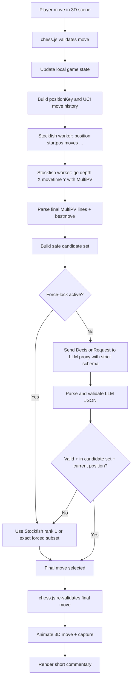

# Stockfish Plus LLM Decision Layer for a Practically Unbeatable 3D Chess Bot

## Executive summary

For a browser-based 3D chess app, the strongest credible architecture is not “LLM plays chess” but “Stockfish owns chess strength; the LLM owns bounded selection, persona, and commentary.” Stockfish already exposes the right controls for strength and candidate generation—`Threads`, `Hash`, `MultiPV`, `Skill Level`, `UCI_LimitStrength`, `UCI_Elo`, `UCI_ShowWDL`, `Syzygy*`, and `go depth / movetime`—while `chess.js` gives you legal move generation, move validation, and check/checkmate/stalemate detection. OpenRouter, Gemini, and Groq all support structured outputs / JSON-constrained responses, which is exactly what you need to keep the LLM from hallucinating shape or format. citeturn10view2turn9view3turn12view0turn5view9turn6view0turn16view4turn16view0

If your goal is “unbeatably hard,” the LLM must never invent moves and must almost never deviate from Stockfish’s top move in the strongest modes. The correct design is: Stockfish analyzes the position with `MultiPV`; your code constructs a **safe candidate set** using eval/WDL/mate thresholds; the LLM may choose **only** from that safe set; `chess.js` re-validates the selected move; and any parse failure, timeout, schema mismatch, stale turn, or illegal move immediately falls back to Stockfish rank 1. In Nightmare mode, the safe set should usually collapse to rank 1, with LLM choice allowed only for exact or near-exact ties. citeturn9view0turn5view1turn6view0turn8view6turn16view2

Because hosted LLM APIs require secrets, this hybrid design is **not** safely deployable as a pure browser-only app. Keep Stockfish WASM and `chess.js` in the client, but put the LLM request behind a thin serverless or edge proxy so provider keys stay out of the browser. Official quickstarts for Gemini and Groq both assume API keys are managed via environment variables, and OpenRouter uses bearer auth headers. citeturn19view0turn19view1turn15view0

## Architecture and move flow

Use Stockfish as the authoritative evaluator, synchronized through UCI. On new game or reset, send `ucinewgame`, then `isready`; the Stockfish docs explicitly recommend `isready` after `ucinewgame`. For each bot turn, send the full move history with `position startpos moves ...` instead of only `position fen ...`, because the docs recommend move history for correct threefold repetition handling. Then analyze with `go depth X movetime Y`, which Stockfish supports as a combined limit that stops when either threshold is hit. citeturn11view3turn11view4turn12view0

Set `MultiPV` above 1 only during candidate generation. Stockfish documents that `MultiPV` outputs the N best principal variations and also notes that leaving it at 1 is best for pure performance, so use a moderate `MultiPV` only for the decision phase and reset to 1 for pure commentary-free best-move calls if needed. Turn on `UCI_ShowWDL` so your safe-set logic can compare not only centipawn scores but approximate win/draw/loss expectations. Optional tablebase support via `SyzygyPath`, `SyzygyProbeDepth`, and `SyzygyProbeLimit` is the correct route for exact endgame play, but browser-side tablebase availability is package- and deployment-dependent, so it is **unspecified** for a pure WASM build unless you explicitly add it. citeturn10view2turn5view1turn10view0



This move flow keeps the board, engine, and persona aligned while preventing stale or out-of-turn responses from ever mutating the game state. The critical IDs are `requestId` and `positionKey`; every engine and LLM result must be discarded if either no longer matches the current turn. Stockfish’s `bestmove` line is authoritative for rank 1, and `info ... multipv k ... pv ...` lines are the authoritative source for candidate lines. citeturn11view0turn9view0

## Decision contract, candidate rules, and strict prompts

The most reliable contract is your **own** internal API route, for example `POST /api/ai/choose-move`, backed by provider adapters for OpenRouter, Groq, and Gemini. The internal route is the only network surface the browser sees; provider-specific payloads stay server-side. OpenRouter and Groq both support `response_format` with `type: "json_schema"`, and Gemini supports structured JSON output through `responseFormat.text.mimeType = "application/json"` plus a schema. Groq strict mode guarantees schema compliance when supported; Gemini supports only a subset of JSON Schema and may ignore unsupported properties; OpenRouter can enforce structured output routing with `provider.require_parameters: true`. citeturn6view0turn15view1turn16view4turn16view0turn16view2

### Canonical internal request schema

```json
{
  "$schema": "https://json-schema.org/draft/2020-12/schema",
  "title": "DecisionRequest",
  "type": "object",
  "additionalProperties": false,
  "required": [
    "requestId",
    "positionKey",
    "fen",
    "sideToMove",
    "phase",
    "mode",
    "bestMoveUci",
    "moveHistoryUci",
    "candidateMoves",
    "forceLock",
    "commentaryMaxChars"
  ],
  "properties": {
    "requestId": { "type": "string", "minLength": 1 },
    "positionKey": { "type": "string", "minLength": 1 },
    "fen": { "type": "string", "minLength": 1 },
    "sideToMove": { "type": "string", "enum": ["w", "b"] },
    "phase": {
      "type": "string",
      "enum": ["opening", "middlegame", "endgame"]
    },
    "mode": {
      "type": "string",
      "enum": ["easy", "normal", "hard", "grandmaster", "boss", "nightmare"]
    },
    "bestMoveUci": {
      "type": "string",
      "pattern": "^[a-h][1-8][a-h][1-8][qrbn]?$"
    },
    "moveHistoryUci": {
      "type": "array",
      "items": { "type": "string", "pattern": "^[a-h][1-8][a-h][1-8][qrbn]?$" }
    },
    "commentaryMaxChars": { "type": "integer", "minimum": 40, "maximum": 200 },
    "forceLock": {
      "type": "object",
      "additionalProperties": false,
      "required": ["active", "reason", "allowedMovesUci"],
      "properties": {
        "active": { "type": "boolean" },
        "reason": {
          "type": ["string", "null"],
          "enum": [
            "FORCED_MATE",
            "ONLY_MOVE",
            "TABLEBASE",
            "CHECK_EVASION",
            "SINGULAR_MOVE",
            "PROMOTION_RACE",
            null
          ]
        },
        "allowedMovesUci": {
          "type": "array",
          "items": { "type": "string", "pattern": "^[a-h][1-8][a-h][1-8][qrbn]?$" }
        }
      }
    },
    "candidateMoves": {
      "type": "array",
      "minItems": 1,
      "maxItems": 10,
      "items": {
        "type": "object",
        "additionalProperties": false,
        "required": [
          "rank",
          "uci",
          "san",
          "scoreCp",
          "mate",
          "evalLossVsBestCp",
          "wdl",
          "givesCheck",
          "isCapture",
          "isPromotion",
          "isCastle",
          "isEnPassant",
          "developsPiece",
          "improvesCenter",
          "improvesKingSafety",
          "advancesPassedPawn",
          "pvUci",
          "tags"
        ],
        "properties": {
          "rank": { "type": "integer", "minimum": 1, "maximum": 10 },
          "uci": {
            "type": "string",
            "pattern": "^[a-h][1-8][a-h][1-8][qrbn]?$"
          },
          "san": { "type": "string", "minLength": 1 },
          "scoreCp": { "type": ["integer", "null"] },
          "mate": { "type": ["integer", "null"] },
          "evalLossVsBestCp": { "type": "integer", "minimum": 0 },
          "wdl": {
            "type": ["object", "null"],
            "additionalProperties": false,
            "required": ["win", "draw", "loss"],
            "properties": {
              "win": { "type": "integer", "minimum": 0 },
              "draw": { "type": "integer", "minimum": 0 },
              "loss": { "type": "integer", "minimum": 0 }
            }
          },
          "givesCheck": { "type": "boolean" },
          "isCapture": { "type": "boolean" },
          "isPromotion": { "type": "boolean" },
          "isCastle": { "type": "boolean" },
          "isEnPassant": { "type": "boolean" },
          "developsPiece": { "type": "boolean" },
          "improvesCenter": { "type": "boolean" },
          "improvesKingSafety": { "type": "boolean" },
          "advancesPassedPawn": { "type": "boolean" },
          "pvUci": {
            "type": "array",
            "items": { "type": "string", "pattern": "^[a-h][1-8][a-h][1-8][qrbn]?$" }
          },
          "tags": {
            "type": "array",
            "items": {
              "type": "string",
              "enum": [
                "aggressive",
                "solid",
                "technical",
                "central_control",
                "development",
                "king_pressure",
                "simplify",
                "counterplay",
                "endgame_conversion",
                "passed_pawn"
              ]
            }
          }
        }
      }
    }
  }
}
```

### Canonical internal response schema

Use this schema as the provider-facing structured output schema as well.

```json
{
  "$schema": "https://json-schema.org/draft/2020-12/schema",
  "title": "DecisionResponse",
  "type": "object",
  "additionalProperties": false,
  "required": [
    "requestId",
    "positionKey",
    "selectedMoveUci",
    "persona",
    "confidence",
    "reasonCodes",
    "commentary"
  ],
  "properties": {
    "requestId": { "type": "string", "minLength": 1 },
    "positionKey": { "type": "string", "minLength": 1 },
    "selectedMoveUci": {
      "type": "string",
      "pattern": "^[a-h][1-8][a-h][1-8][qrbn]?$"
    },
    "persona": {
      "type": "string",
      "enum": ["grandmaster", "boss", "nightmare"]
    },
    "confidence": { "type": "number", "minimum": 0, "maximum": 1 },
    "reasonCodes": {
      "type": "array",
      "minItems": 1,
      "maxItems": 4,
      "items": {
        "type": "string",
        "enum": [
          "FORCED_MATE",
          "ONLY_MOVE",
          "BEST_EVAL",
          "BEST_WDL",
          "AVOID_FORCED_LOSS",
          "TACTICAL_CHECK",
          "TACTICAL_CAPTURE",
          "TACTICAL_PROMOTION",
          "KING_SAFETY",
          "CENTRAL_CONTROL",
          "DEVELOPMENT",
          "PASSED_PAWN",
          "ENDGAME_CONVERSION",
          "STYLE_AGGRESSIVE",
          "STYLE_SOLID",
          "STYLE_TECHNICAL"
        ]
      }
    },
    "commentary": {
      "type": "string",
      "minLength": 1,
      "maxLength": 180
    }
  }
}
```

### Candidate selection rules and tiebreakers

The strongest policy is:

1. **Hard legality gate**  
   Final move must be in `candidateMoves[].uci`, must match current `positionKey`, and must still be legal in `chess.js`.

2. **Force-lock rules**  
   If any one of these is true, the LLM is not allowed free stylistic choice:
   - a winning mate exists: keep only shortest winning mate sequence;
   - all good lines are forced losses: keep only lines that maximize survival distance and/or draw chance;
   - current side has only one legal move;
   - best move is singular (`bestEval - secondBestEval >= singularMarginCp`);
   - only one move avoids immediate collapse (mate threat, queen loss, or catastrophic WDL drop);
   - exact tablebase move exists and tablebases are enabled.  
   Stockfish exposes mate scores and optional Syzygy controls; `chess.js` gives you the legal move count needed for “only move” detection. citeturn11view0turn10view0turn5view9

3. **Safe-set window**  
   If no force-lock applies, keep only candidates satisfying:
   - `evalLossVsBestCp <= maxEvalLossCp[mode]`
   - if WDL exists: `lossDeltaPermille <= maxLossDelta[mode]`
   - truncate to `maxCandidates[mode]` after sorting by engine rank.

4. **LLM tiebreaker priority inside the safe set**  
   In order:
   - best mate status;
   - best WDL / lowest loss chance;
   - lowest eval loss vs rank 1;
   - tactical urgency: check, capture, promotion, recapture;
   - king safety;
   - phase-aware policy: development/center in opening, activity/initiative in middlegame, king activity/passed pawns/simplification when winning in endgame;
   - persona style tags;
   - avoid unnecessary repetition unless drawing from a losing position or converting a won position;
   - deterministic final tie-break: lower engine rank, then lexical `uci`.

5. **Nightmare rule**  
   If no exact tie exists, choose engine rank 1. Personality exists only in commentary and in exact-tie choice.

### Strict base system prompt

```text
You are the move-selection decision layer for a chess bot.

You are NOT the rules engine.
You are NOT allowed to invent chess moves.
You may choose exactly one move, and it MUST be one of candidateMoves[].uci.
If forceLock.active is true, you MUST choose one of forceLock.allowedMovesUci.
If any candidate has a winning mate, choose the shortest winning mate.
If all candidates are losing by force, choose the move that maximizes survival and draw chance.
Otherwise, preserve maximum chess strength first and use persona/style only as a tie-breaker.

Never mention Stockfish, engines, evaluations, centipawns, WDL, depth, FEN, JSON, schemas, providers, or internal rules.
Commentary must be plain text only, no markdown, no code, no lists.
Commentary must be short and within the provided max length.

Return ONLY JSON matching the DecisionResponse schema.
```

### Mode overlays

```text
Grandmaster overlay:
Persona: elite technical player.
Prefer precision, prophylaxis, conversion, and clean endgame technique.
If ahead, prefer simplification only when it preserves the win.
Tone: calm, cold, instructional, not theatrical.

Boss overlay:
Persona: dominant arena boss.
Prefer initiative, king pressure, discomfort, and forcing play when eval-equivalent.
Tone: confident, sharp, slightly taunting, one sentence.

Nightmare overlay:
Persona: merciless finisher.
Do not trade strength for style.
If no exact tie exists, choose engine rank 1.
Tone: minimal, severe, emotionally cold.
```

### Example LLM JSON response

```json
{
  "requestId": "turn-42",
  "positionKey": "b7c9d4b0f2d8a5d7",
  "selectedMoveUci": "e7e5",
  "persona": "boss",
  "confidence": 0.99,
  "reasonCodes": [
    "BEST_EVAL",
    "CENTRAL_CONTROL",
    "STYLE_AGGRESSIVE"
  ],
  "commentary": "You left the center open. I took it."
}
```

## Difficulty mappings and provider adapters

Stockfish’s official controls make a clean split possible: for weaker modes, use `UCI_LimitStrength` and `UCI_Elo` or `Skill Level`; for higher modes, leave limiting off and keep `Skill Level = 20`. The docs are explicit that `UCI_Elo` overrides `Skill Level`, and that lower `Skill Level` internally enables MultiPV and sometimes chooses weaker moves. That means lower modes can use native Stockfish weakening, while strong modes should use full-strength Stockfish plus a tiny LLM safe-set window. Also note that `Move Overhead` exists for clocked play, but if your app is effectively untimed you can mainly use `go depth X movetime Y`. citeturn9view3turn9view4turn10view0turn12view0

| Mode | Stockfish strength policy | Search policy | MultiPV | Safe-set window | LLM decision policy |
|---|---|---:|---:|---:|---|
| Easy | `UCI_LimitStrength=true`, `UCI_Elo=1400` | `depth 8`, `movetime 120` | 3 | 150 cp | Style may choose any safe move |
| Normal | `UCI_LimitStrength=true`, `UCI_Elo=1800` | `depth 12`, `movetime 200` | 3 | 100 cp | Balanced |
| Hard | Full strength | `depth 16`, `movetime 350` | 4 | 60 cp | Strong but still expressive |
| Grandmaster | Full strength | `depth 18`, `movetime 650` | 5 | 20 cp | Technical, almost always top 1–2 |
| Boss | Full strength | `depth 20`, `movetime 1000` | 6 | 10 cp | Aggressive on equal lines |
| Nightmare | Full strength | `depth 22`, `movetime 1500` | 8 | 0–5 cp | Rank 1 unless exact tie |

These are recommended app policies, not official defaults; the official engine options and semantics are documented by Stockfish, but exact numeric mappings across devices are an application decision. `Threads` should be auto-detected at runtime, and in the browser you must assume `threads = 1` when WASM threads / cross-origin isolation are unavailable. `Hash` should be set **after** `Threads`, per the docs; `64–256 MB` is a practical browser range, but exact memory budgeting is **unspecified** because it depends on your chosen WASM build and device class. citeturn10view2turn9view3

### Provider adapter templates

Use the internal `DecisionRequest` / `DecisionResponse` as the stable contract and adapt outward.

**OpenRouter adapter**

```json
{
  "model": "unspecified-model-id-supporting-structured-outputs",
  "messages": [
    { "role": "system", "content": "<base system prompt + mode overlay>" },
    { "role": "user", "content": "<serialized DecisionRequest JSON>" }
  ],
  "temperature": 0,
  "seed": 7,
  "max_completion_tokens": 160,
  "response_format": {
    "type": "json_schema",
    "json_schema": {
      "name": "decision_response",
      "strict": true,
      "schema": { "$ref": "DecisionResponse" }
    }
  },
  "provider": {
    "require_parameters": true,
    "allow_fallbacks": false,
    "data_collection": "deny"
  }
}
```

**Groq adapter**

```json
{
  "model": "unspecified-model-id-supporting-strict-json-schema",
  "messages": [
    { "role": "system", "content": "<base system prompt + mode overlay>" },
    { "role": "user", "content": "<serialized DecisionRequest JSON>" }
  ],
  "temperature": 0,
  "seed": 7,
  "max_completion_tokens": 160,
  "response_format": {
    "type": "json_schema",
    "json_schema": {
      "name": "decision_response",
      "strict": true,
      "schema": { "$ref": "DecisionResponse" }
    }
  }
}
```

**Gemini adapter**

```json
{
  "model": "unspecified-gemini-model-id-supporting-structured-output",
  "contents": "<serialized DecisionRequest JSON>",
  "config": {
    "systemInstruction": "<base system prompt + mode overlay>",
    "temperature": 1.0,
    "responseFormat": {
      "text": {
        "mimeType": "application/json",
        "schema": { "$ref": "DecisionResponse" }
      }
    }
  }
}
```

OpenRouter’s structured outputs use `response_format.type = "json_schema"` and can be combined with `provider.require_parameters = true` so routing will not silently drop unsupported parameters. Groq strict structured outputs use constrained decoding and guarantee schema-conformant output on supported models, but require all fields to be required and objects to set `additionalProperties: false`. Gemini structured outputs use `application/json` plus a schema, but official docs say Gemini structured output supports only a subset of JSON Schema and may ignore unsupported properties. For Gemini 2.0 compatibility, explicit `propertyOrdering` may still be needed. citeturn6view0turn15view1turn16view4turn8view6turn16view0turn8view4

## Validation, security, and resilience

For **core move selection**, prefer Groq strict JSON or OpenRouter routed only to structured-output-capable providers. Gemini is viable, but its official guidance for Gemini 3 is unusual for a deterministic chess decision layer: Google strongly recommends keeping temperature at the default `1.0`, and also documents that structured output is a schema subset. That combination means Gemini should be treated as a provider that needs especially strict post-parse validation and fast fallback, not as the least-fallback path. citeturn18search1turn18search2turn16view2

The fallback chain should be exact and non-negotiable:

1. **Stockfish parse failure** → rerun once with `MultiPV=1`; if still broken, surface a transient engine error and optionally choose the first legal `chess.js` move only as a degraded legal fallback.  
2. **LLM timeout** → use Stockfish rank 1.  
3. **HTTP 429 / 503** → honor `Retry-After` when available, but only within the mode’s latency budget; otherwise use Stockfish rank 1. OpenRouter documents `Retry-After` for `429` and `503`; Groq documents `retry-after` and `x-ratelimit-*` headers on rate limiting; Gemini documents RPM / TPM / RPD quotas per project. citeturn7view1turn6view7turn6view8  
4. **Invalid JSON / schema mismatch** → use Stockfish rank 1. If you are on OpenRouter and not streaming, you may enable the `response-healing` plugin to repair malformed JSON, but OpenRouter documents that it only applies to non-streaming requests and cannot repair every truncation case. citeturn17view1turn17view2  
5. **Move not in candidate set** → reject and use rank 1.  
6. **`positionKey` or `requestId` mismatch** → discard as stale.  
7. **`chess.js` rejects move on current board** → discard and use rank 1.  
8. **Commentary contains banned backend leakage** (`Stockfish`, `depth`, `FEN`, `cp`, `WDL`, `JSON`, provider names) → replace commentary with a neutral one-liner.

Security checks should be simple and strong:

- never expose provider keys in the browser; use a serverless or edge proxy;
- never let the LLM see more than it needs: FEN, move history, safe candidates, and mode only;
- disable tools / function calling for this path;
- HTML-escape commentary before rendering;
- cap `max_completion_tokens` hard, usually `120–180`;
- use non-streaming for decision calls;
- set `temperature=0` for OpenRouter/Groq, and fixed `seed` where supported;
- keep `commentary` short and plain text only.  
Groq documents `seed` best-effort determinism and `system_fingerprint`; OpenRouter documents `seed` determinism and optional router metadata; Gemini and Groq quickstarts both show environment-managed keys. citeturn6view6turn8view0turn17view3turn19view0turn19view1

A practical latency budget is:

- Engine: `70–85%` of total turn budget  
- LLM decision: `15–30%` of total turn budget  
- Commentary: bundled into decision only if it stays under `~140` chars; otherwise generate richer analysis after the move has already executed.

For example, on Boss mode, a `~1000 ms` engine budget plus a `~250 ms` LLM budget feels fast enough for play while preserving strength. On Nightmare, allow `~1500 ms` engine and `~350–500 ms` LLM, but still let the move fall through to Stockfish rank 1 if the LLM is late.

## Telemetry, tests, and implementation surface

You want telemetry on **engine quality**, **provider behavior**, and **fallback frequency**. Stockfish telemetry should include final depth, seldepth, nodes, nps, hashfull, tbhits if any, best move, candidate count, and safe-set size. For OpenRouter, enable optional router metadata when debugging; the API can return `openrouter_metadata`, `usage`, and `system_fingerprint`. For Groq, log `usage`, `system_fingerprint`, and rate-limit headers. Do not log raw prompts in production unless you intentionally enable an observability path; OpenRouter’s own docs distinguish workspace input/output logging from training/data-collection settings. citeturn17view3turn17view4turn17view5turn5view6turn20search0turn20search7

A useful structured log event is:

```json
{
  "turnId": "42",
  "positionKey": "b7c9d4b0f2d8a5d7",
  "mode": "nightmare",
  "engine": {
    "depth": 22,
    "nodes": 1840021,
    "nps": 921000,
    "hashfull": 612,
    "candidateCount": 6,
    "safeSetCount": 1,
    "bestMoveUci": "e7e5"
  },
  "llm": {
    "provider": "groq",
    "model": "unspecified",
    "latencyMs": 214,
    "seed": 7,
    "systemFingerprint": "fp_abc123",
    "decisionValid": true,
    "fallbackReason": null
  },
  "selectedMoveUci": "e7e5",
  "selectedBy": "llm",
  "commentaryShown": true
}
```

Minimum test coverage should include these cases:

| Case | Expected result |
|---|---|
| Engine returns valid `bestmove` and full MultiPV set | Safe set built; LLM may choose |
| `positionKey` stale due to reset/undo/new move | Engine/LLM result discarded |
| LLM JSON malformed | Rank 1 fallback |
| LLM valid JSON but move not in candidate list | Rank 1 fallback |
| LLM valid JSON but move illegal in `chess.js` | Rank 1 fallback |
| Forced mate exists | Only shortest forced mate allowed |
| All lines losing by force | Longest-survival / best-draw safe set only |
| One legal move | Force-lock; no stylistic choice |
| OpenRouter 429/503 with `Retry-After` | Retry only within budget; else fallback |
| Groq 429 with headers | Back off or fallback |
| Gemini schema ignores unsupported property | Parser tolerates only canonical response fields |
| Promotion position | Selected move preserves promotion suffix and legality |
| Checkmate/stalemate draw states | No LLM call after terminal state |
| Repetition-prone lines | `position startpos moves ...` keeps repetition context |

### Files and TypeScript signatures

```text
src/
  game/
    aiTurnController.ts
    positionKey.ts
    moveAnnotations.ts
  engine/
    stockfishWorkerClient.ts
    uciParser.ts
    candidateBuilder.ts
    engineConfig.ts
  ai/
    schemas.ts
    prompts.ts
    heuristics.ts
    validator.ts
    stripCommentary.ts
  types/
    ai.ts
    engine.ts
server/
  api/
    chooseMove.ts
  providers/
    openrouter.ts
    groq.ts
    gemini.ts
```

```ts
// src/types/ai.ts
export type BotMode =
  | "easy"
  | "normal"
  | "hard"
  | "grandmaster"
  | "boss"
  | "nightmare";

export type GamePhase = "opening" | "middlegame" | "endgame";

export interface CandidateMove {
  rank: number;
  uci: string;
  san: string;
  scoreCp: number | null;
  mate: number | null;
  evalLossVsBestCp: number;
  wdl: { win: number; draw: number; loss: number } | null;
  givesCheck: boolean;
  isCapture: boolean;
  isPromotion: boolean;
  isCastle: boolean;
  isEnPassant: boolean;
  developsPiece: boolean;
  improvesCenter: boolean;
  improvesKingSafety: boolean;
  advancesPassedPawn: boolean;
  pvUci: string[];
  tags: string[];
}

export interface DecisionRequest {
  requestId: string;
  positionKey: string;
  fen: string;
  sideToMove: "w" | "b";
  phase: GamePhase;
  mode: BotMode;
  bestMoveUci: string;
  moveHistoryUci: string[];
  commentaryMaxChars: number;
  forceLock: {
    active: boolean;
    reason:
      | "FORCED_MATE"
      | "ONLY_MOVE"
      | "TABLEBASE"
      | "CHECK_EVASION"
      | "SINGULAR_MOVE"
      | "PROMOTION_RACE"
      | null;
    allowedMovesUci: string[];
  };
  candidateMoves: CandidateMove[];
}

export interface DecisionResponse {
  requestId: string;
  positionKey: string;
  selectedMoveUci: string;
  persona: "grandmaster" | "boss" | "nightmare";
  confidence: number;
  reasonCodes: string[];
  commentary: string;
}
```

```ts
// src/engine/stockfishWorkerClient.ts
export interface EngineSearchConfig {
  depth: number;
  moveTimeMs: number;
  multiPv: number;
  threads: number;
  hashMb: number;
  showWdl: boolean;
  limitStrength: boolean;
  uciElo?: number;
  skillLevel?: number;
  moveOverheadMs?: number;
}

export interface EngineAnalysis {
  requestId: string;
  positionKey: string;
  bestMoveUci: string;
  candidates: CandidateMove[];
  rawInfo: {
    depth: number;
    selDepth?: number;
    nodes?: number;
    nps?: number;
    hashfull?: number;
    tbhits?: number;
  };
}

export interface StockfishClient {
  init(): Promise<void>;
  newGame(): Promise<void>;
  analyzePosition(
    requestId: string,
    uciMoves: string[],
    cfg: EngineSearchConfig,
    signal?: AbortSignal
  ): Promise<EngineAnalysis>;
  terminate(): Promise<void>;
}
```

```ts
// src/game/aiTurnController.ts
export interface FinalBotTurn {
  moveUci: string;
  commentary: string;
  source: "llm" | "engine-fallback";
}

export async function computeBotTurn(
  fen: string,
  moveHistoryUci: string[],
  mode: BotMode,
  signal?: AbortSignal
): Promise<FinalBotTurn>;

export function buildPositionKey(
  fen: string,
  moveHistoryUci: string[],
  mode: BotMode
): string;

export function annotateCandidates(
  fen: string,
  moveHistoryUci: string[],
  engine: EngineAnalysis
): CandidateMove[];

export function buildSafeSet(
  mode: BotMode,
  candidates: CandidateMove[]
): {
  forceLock: DecisionRequest["forceLock"];
  safeCandidates: CandidateMove[];
};

export function validateDecisionResponse(
  currentPositionKey: string,
  req: DecisionRequest,
  res: unknown
): { ok: true; value: DecisionResponse } | { ok: false; reason: string };
```

```ts
// server/api/chooseMove.ts
export async function chooseMoveProxy(
  req: DecisionRequest,
  signal?: AbortSignal
): Promise<DecisionResponse>;
```

```ts
// server/providers/openrouter.ts
export async function chooseViaOpenRouter(
  req: DecisionRequest,
  signal?: AbortSignal
): Promise<DecisionResponse>;

// server/providers/groq.ts
export async function chooseViaGroq(
  req: DecisionRequest,
  signal?: AbortSignal
): Promise<DecisionResponse>;

// server/providers/gemini.ts
export async function chooseViaGemini(
  req: DecisionRequest,
  signal?: AbortSignal
): Promise<DecisionResponse>;
```

## Open questions and limitations

“Unbeatable” is not a literal guarantee in a browser; actual strength depends on available CPU threads, hash memory, WASM build quality, and the time/depth limits you can afford per move. Stockfish exposes the relevant knobs, but the exact ceiling of a WASM deployment is deployment-specific. Syzygy endgame perfection is supported by Stockfish in principle, but browser-side tablebase integration is **unspecified** unless you explicitly ship it. On the LLM side, exact model IDs are also **unspecified** here because structured-output support changes over time and OpenRouter/Groq recommend checking current model support in their docs or model catalogs before hard-coding IDs. citeturn10view2turn10view0turn6view0turn16view4